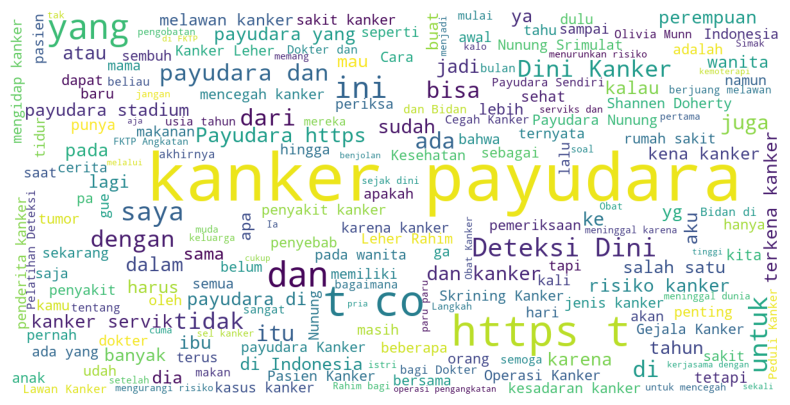

# Perbandingan Analisis Kesadaran Kanker Payudara via X — SVM vs Naive Bayes

## Overview

Analisis sentimen pada dataset tweet tentang kesadaran kanker payudara menggunakan dua model machine learning: Support Vector Machine (SVM) dan Naive Bayes. Project ini bertujuan untuk mengklasifikasikan tweet menjadi sentimen positif dan negatif. 

## Features

- Preprocessing data teks
- Visualisasi WordCloud
- Analisis kata paling sering muncul
- Pembuatan model SVM dan Naive Bayes
- Evaluasi model dengan confusion matrix
- Cross-validation 5-fold
- Generate laporan HTML otomatis

## Results

| Model | Accuracy | Precision | Recall | F1-Score |
| SVM    | 88.0% | 0.87 | 0.89 | 0.88 |
| Naive Bayes | 85.0% | 0.84 | 0.86 | 0.85 |

Hasil menunjukkan bahwa masyarakat di Indonesia sudah sadar mengenai bahaya kanker payudara hal itu dibuktikan dengan junmlah sentimen positif yang lebih banyak daripada jumlah sentimen negatif. Sentimen Positif berjumlah 1200 dan sentimen negatif berjumlah 800. Hasil akurasi

Visualization Results

### WordCloud Analysis


### Sentiment Distribution


### Model Performance
| Confusion Matrix - SVM | Confusion Matrix - Naive Bayes |
|------------------------|--------------------------------|
|  |  |

### Top Frequent Words
```python
# Contoh output
   word        count
   kanker      156
   payudara    142
   awareness   89
   breast      76
   cancer      72

## Installation

1. Clone repository:
```bash
git clone https://github.com/yudhamahardika/brest-cancer-awareness-dashboard.git

## Requirements
```
pandas
numpy
scikit-learn
matplotlib
wordcloud
```

